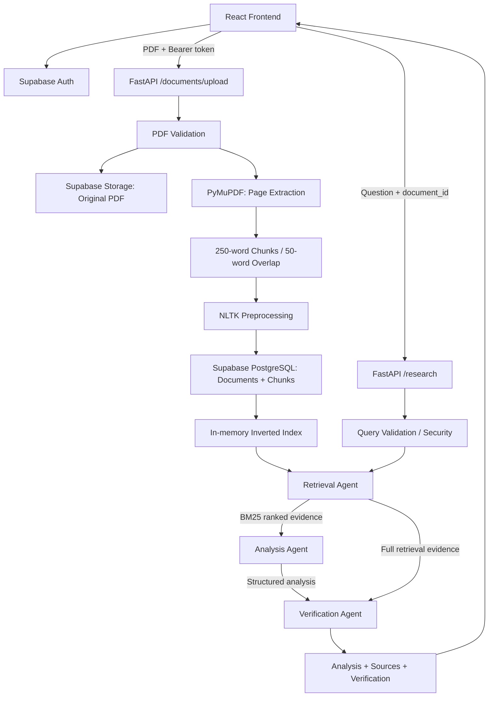

# ResoMind — Agentic AI Scientific Research System

ResoMind is a multi-agent scientific research assistant developed for the **Information Retrieval and Web Analytics (IT3041)** group assignment. The system helps users upload scientific PDF papers, retrieve relevant evidence, generate a structured analysis with Google Gemini, and verify generated claims against the retrieved evidence.

> **Academic prototype:** ResoMind is designed to support researcher review. Retrieval scores and verification labels should not be interpreted as scientific truth, probability, or accuracy percentages.

## Features

- Supabase Auth email/password authentication
- Authenticated scientific PDF upload
- PDF validation and page-by-page text extraction with PyMuPDF
- Page-local overlapping text chunking
- NLTK preprocessing: lowercasing, tokenization, punctuation filtering, English stopword removal, WordNet lemmatization
- In-memory inverted index
- Custom BM25 evidence retrieval
- Query-coverage and reference-section ranking heuristics
- Structured Gemini analysis: summary, key findings, methods/models, conclusion
- Claim verification using lexical checks and Gemini semantic assessment when available
- Lexical fallback when semantic verification is unavailable
- Source traceability with filename, page number, chunk number, and retrieval score
- Responsible-AI-oriented human review workflow

## System Architecture



### Research Workflow

1. User signs in through Supabase Auth.
2. User uploads a scientific PDF.
3. FastAPI validates the upload.
4. PyMuPDF extracts text page by page.
5. Each page is divided into chunks of up to **250 words** with **50-word overlap**.
6. NLTK preprocesses each chunk.
7. Document metadata and chunks are stored in Supabase PostgreSQL.
8. The original PDF is stored in Supabase Storage.
9. An in-memory inverted index is built from processed chunk text.
10. A research question is preprocessed using the same NLP pipeline.
11. The Retrieval Agent uses BM25 to rank matching chunks.
12. The Analysis Agent sends the question and retrieved text to Gemini.
13. The Verification Agent checks generated claims against the retrieved evidence.
14. The frontend displays the analysis, source metadata, verification information, and Responsible AI notice.

## Agent Roles

### Retrieval Agent

The Retrieval Agent provides the evidence foundation for the system.

Responsibilities:
- Query preprocessing
- Inverted-index lookup
- BM25 ranking
- Query-term coverage adjustment
- Reference-section penalty
- Evidence selection
- Source metadata preservation

Current BM25 parameters:

```text
k1 = 1.5
b  = 0.75
```

A retrieval result can include:

```text
document_id
chunk_id
filename
category
page_number
chunk_number
score
matched_terms
text
```

The retrieval score is a **lexical ranking score**, not a confidence percentage or correctness score.

### Analysis Agent

The Analysis Agent receives the research question plus retrieved chunk text. It uses Google Gemini to produce:
- Summary
- Key findings
- Methods/models
- Conclusion

The Analysis Agent receives retrieved **text strings**, not structured filename/page/chunk/score metadata.

### Verification Agent

The Verification Agent receives the analysis output plus the full retrieval output. It extracts claims and checks them using:
- lexical evidence comparison
- Gemini semantic assessment when available
- lexical fallback when semantic verification is unavailable

Verification is limited to the evidence retrieved by ResoMind and should not be treated as proof of universal scientific correctness.

## Technology Stack

| Area | Technology |
|---|---|
| Frontend | React, JavaScript, CSS, React Router, Vite |
| Backend | Python, FastAPI, Uvicorn |
| Authentication | Supabase Auth |
| Database | Supabase PostgreSQL |
| PDF Storage | Supabase Storage |
| PDF Processing | PyMuPDF |
| NLP | NLTK |
| Information Retrieval | Custom BM25 + in-memory inverted index |
| LLM | Google Gemini via `google-genai` |
| API Communication | HTTP/JSON, multipart upload |
| Internal Agent Communication | Direct Python method calls |

## Repository Structure

```text
scientific-research-ai/
├── backend/
│   ├── app/
│   │   ├── agents/
│   │   ├── api/
│   │   ├── core/
│   │   ├── services/
│   │   ├── models/
│   │   └── main.py
│   ├── supabase/
│   │   └── schema.sql
│   ├── tests/
│   ├── requirements.txt
│   └── .env.example
├── frontend/
│   ├── src/
│   └── package.json
├── docs/
└── README.md
```

## Setup

### Prerequisites

Install:
- Python
- Node.js and npm
- A Supabase project
- A Google Gemini API key

Clone the repository:

```bash
git clone <YOUR_REPOSITORY_URL>
cd scientific-research-ai
```

### Backend

#### Windows PowerShell

```powershell
python -m venv backend\.venv
.\backend\.venv\Scripts\Activate.ps1
python -m pip install -r backend\requirements.txt
Copy-Item backend\.env.example backend\.env
```

Fill `backend/.env` with the configuration required by the application. **Do not commit secret values.**

Apply the database schema from:

```text
backend/supabase/schema.sql
```

Configure the Supabase Storage bucket expected by the backend:

```text
research-papers
```

Start the backend:

```powershell
python -m uvicorn app.main:app --app-dir backend --env-file backend\.env
```

Default backend address:

```text
http://127.0.0.1:8000
```

### Frontend

Open a second terminal:

```powershell
cd frontend
npm install
npm run dev
```

Configure the frontend Supabase client according to the existing project configuration in:

```text
frontend/src/services/supabase.js
```

Vite will print the local frontend URL when it starts.

> Never commit API keys, service-role keys, access tokens, passwords, or populated `.env` files.

## Usage

1. Start the backend.
2. Start the frontend.
3. Sign in.
4. Upload a readable scientific PDF.
5. Wait until the document is indexed.
6. Enter a research question.
7. Review the structured analysis, retrieved source metadata, verification status/warnings, and Responsible AI notice.
8. Check important findings against the original research paper.

### Example Research Question

```text
What classifier was used for breast cancer classification?
```

The actual answer and verification result depend on the uploaded paper and current model response.

## Important API Endpoints

| Method | Endpoint | Purpose |
|---|---|---|
| `POST` | `/documents/upload` | Upload and ingest a PDF |
| `POST` | `/research` | Run retrieval → analysis → verification |
| `POST` | `/agents/retrieve` | Run the Retrieval Agent directly |
| `POST` | `/analyze` | Run analysis on supplied context |
| `POST` | `/verify` | Run verification |
| `GET` | `/test-nlp` | Inspect NLP preprocessing |
| `GET` | `/health` | Basic backend health response |

Protected research endpoints use Bearer-token authentication.

## Retrieval Details

### Chunking

```text
Maximum chunk size: 250 words
Overlap:            50 words
Stride:             200 words
Cross-page chunks:  No
```

### NLP Pipeline

```text
lowercase
→ NLTK word_tokenize
→ remove punctuation-only tokens
→ remove empty tokens
→ remove English stopwords
→ require at least one alphanumeric character
→ WordNet lemmatization as verb
→ WordNet lemmatization as noun
```

The implementation uses **lemmatization**, not stemming.

### Inverted Index

```text
term → chunk_id → term_frequency
```

The index is process-local memory. Persistent chunk text and processed text are stored in Supabase and can be used to reconstruct it.

### BM25

```text
k1 = 1.5
b  = 0.75
```

Final ranking additionally applies query coverage adjustment and a reference-section penalty. The final selection allows at most two chunks from one document before applying the requested result limit.

## Database and Storage

### `documents`

Stores document-level metadata such as UUID, original filename, storage path, MIME type, file size, page count, category/optional metadata, status, and creation time.

### `document_chunks`

Stores chunk UUID, document UUID, page number, chunk number, readable `chunk_text`, normalized `processed_text`, and processed token count.

Relationship:

```text
documents
    1
    │
    └──────── many document_chunks
```

The original PDF bytes are stored separately in Supabase Storage.

## Security

Implemented controls include:
- Bearer-token authentication on protected routes
- Supabase token validation
- PDF and filename validation
- upload size limits
- query validation
- selected prompt-injection pattern checks
- selected sensitive-query handling
- sanitized backend errors
- server-side secret configuration

Security limitations remain. Authentication identifies the caller, but the current implementation does not provide complete per-user document ownership isolation.

## Responsible AI

ResoMind is a research-support prototype rather than an autonomous scientific authority.

The system supports review through:
- source filename traceability
- page and chunk references
- explicit retrieval scores
- verification against retrieved evidence
- Responsible AI messaging
- human review of original papers

Important:
- A retrieval score is not accuracy or confidence.
- Verification is limited to the retrieved evidence.
- The system does not independently establish scientific truth.
- Human review remains necessary.

## Current Limitations

- Retrieval is lexical BM25 rather than embedding/vector retrieval.
- Semantic vector search is not implemented.
- OCR is not implemented for image-only scanned PDFs.
- Page-local word-window chunking can split sentences.
- Overlap can produce duplicate or highly similar evidence.
- No semantic reranker is currently used.
- There is no minimum relevance threshold in the current retrieval path.
- The in-memory index is process-local.
- Per-user document ownership/isolation is incomplete.
- Verification can be affected by external LLM availability or rate limits.
- The verifier checks the retrieved subset rather than searching wider literature.
- The project should not be described as autonomous internet-wide research.

## Future Improvements

Potential future work:
- Hybrid BM25 + embedding retrieval
- Semantic reranking
- Retrieval-quality evaluation on labelled question/evidence datasets
- Sentence-aware or structure-aware chunking
- OCR for scanned research papers
- Incremental/shared retrieval indexing
- Stronger per-user/team document authorization
- Better duplicate-evidence control
- Explicit minimum relevance thresholds
- Stronger document-content prompt-injection defenses
- Improved evidence viewing and claim-to-source linking

These are proposed improvements, not current implementation claims.

## Team Contributions

Replace the placeholders with the actual names and student IDs before final submission.

| Member | Name / Student ID | Main Contribution |
|---|---|---|
| Member 1 | **[IT23858466]** | PDF upload backend , extraction , Chuncking, NLP preprocessing, indexing, Retrieval Agent,Database integration |
| Member 2 | **[IT23838420]** | LLM integration , Summarization/Comparisson , Prompts , Structured outputs , Analysis Agent and Gemini-based structured analysis |
| Member 3 | **[IT23842526]** | Verification Agent , Source checking , Hallucination handling , Authentication / Privacy |
| Member 4 | **[IT23832930]** | UI , Research input , PDF upload UI , Result/Source display , API integration , End to end testing |

## Academic Context

Developed for:

**Information Retrieval and Web Analytics (IT3041)**  
**Assignment:** Design and Implementation of an Agentic AI System Integrating LLMs, NLP, Security, and Information Retrieval

## License / Usage

This repository was developed as a university academic project. Before adding an open-source license, the project team should confirm the intended licensing terms and ownership requirements.
