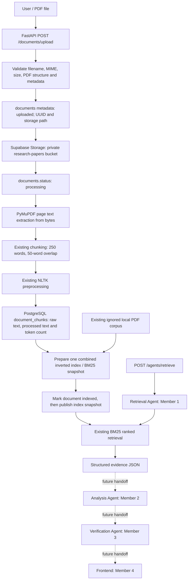

# Scientific Research AI architecture

Member 1 owns PDF validation and ingestion, extraction, chunking, NLTK
preprocessing, the custom inverted index, BM25 ranking, and structured evidence
from the Retrieval Agent. The upload endpoint now connects these services to
Supabase while retaining the existing local corpus as a compatibility source.

## Implemented ingestion and retrieval flow

Supabase provides persistence. Its private Storage bucket holds the actual PDF
bytes. PostgreSQL holds document metadata and extracted text; it never stores raw
PDF binaries. PostgreSQL does not replace BM25. The existing Python inverted
index and BM25 remain the Information Retrieval implementation, with the original
scoring formula, query coverage adjustment, and reference penalties unchanged.
No vectors, embeddings, or external retrieval framework are introduced.

## Service boundaries

| Component | Responsibility |
| --- | --- |
| `app/api/documents.py` | Multipart upload handling, bounded file reads, typed responses, and safe HTTP errors. |
| `app/services/ingestion_service.py` | Validate and coordinate storage, metadata, extraction, chunk persistence, status changes, and index refresh. |
| `app/services/document_service.py` | Inspect PDFs and extract page text from paths or uploaded bytes. |
| `app/services/chunking_service.py` | Existing page-based text chunking. |
| `app/services/nlp_service.py` | Existing NLTK tokenization, filtering, and lemmatization. |
| `app/services/database_service.py` | Typed document/chunk persistence and indexed-document reads. |
| `app/services/storage_service.py` | Upload/download/delete individual PDF objects in the existing private bucket. |
| `app/services/retrieval_index_service.py` | Adapt persistent rows and local chunks into one cached index; coordinate explicit refresh and publication. |
| `app/services/indexing_service.py` | Existing inverted index; reuse stored processed tokens when available. |
| `app/services/retrieval_service.py` | Existing BM25 ranking and evidence selection. |
| `app/agents/retrieval_agent.py` | Existing query validation and structured evidence interface. |
| `app/core/config.py`, `app/core/supabase_client.py` | Backend-only settings and a lazily initialized Supabase client. |

The Retrieval Agent makes no Supabase SDK calls. The upload endpoint runs the
synchronous ingestion service in FastAPI's worker thread pool. No background job
queue is introduced; a successful HTTP 201 response means the document is indexed
and searchable in that backend process.

## PDF validation and persistent identity

Before contacting Supabase, ingestion requires a filename ending in `.pdf`, MIME
type `application/pdf`, nonempty bytes, a `%PDF-` header, and a file no larger than
25,000,000 bytes. PyMuPDF verifies the document can be opened and determines its
page count before metadata insertion. Encrypted or unreadable PDFs are rejected.
Path separators, traversal names, and control characters are rejected; the object
filename is sanitized. Optional metadata is length-limited, and source URLs must
use HTTP or HTTPS without embedded credentials. Image-only PDFs need OCR, which
is outside this implementation; a PDF without searchable extracted text fails.

Each upload receives a new Python `uuid4` UUID that is inserted as the PostgreSQL
`documents.id` primary key. The returned row must confirm the same ID and storage
path. This allows metadata to be created before upload while satisfying the
existing non-null, unique `storage_path` constraint. PostgreSQL's UUID default
remains available for other metadata callers; no schema or grant change is needed.

The object key is `documents/{document_id}/{sanitized_filename}`. Two files named
`paper.pdf` receive separate document UUIDs and object paths; neither upload
silently overwrites the other. Reuploading identical content is a separate
document because content deduplication is not implemented.

PostgreSQL assigns each `document_chunks.id` its UUID. Each chunk also records the
parent document UUID and one-based `(page_number, chunk_number)` positions, unique
within that document. `chunk_text` retains the extracted evidence;
`processed_text` stores space-joined NLP tokens and `token_count` stores their
count. Persistent retrieval results use the chunk UUID as `chunk_id` and include
`document_id`. The two-chunks-per-paper rule uses document UUIDs for uploaded
documents, so duplicate filenames do not merge independent sources.

## Index refresh and temporary local compatibility

`retrieval_index_service.py` builds one in-memory index containing both indexed
Supabase chunks and the existing ignored local PDFs. It reuses the existing
extraction/chunking/NLP services for local data and processed tokens for persistent
chunks. Local chunk IDs retain `<filename>_p<page_number>_c<chunk_number>`. Local
PDFs are not uploaded automatically, deleted, or added to Git. The intended
persistent source is Supabase; removal of the compatibility corpus and controlled
corpus migration remain separate work.

The first retrieval query builds and caches a completed snapshot. Later queries
reuse it and do not requery Supabase or rebuild the index. If Supabase is
unconfigured or unavailable on first load, local retrieval remains available. A
configured database read failure emits a sanitized warning and the local-only
snapshot remains cached until explicit refresh or restart. It does not silently
retry database reads on every query.

Successful ingestion calls `refresh_retrieval_index(...)`. Refresh strictly reads
persistent chunks, includes the pending document whose status is `processing`,
and prepares a replacement index under a process lock. Once that build succeeds,
the completion callback marks the document `indexed`; only then is the completed
snapshot published. A read, build, or status-update failure preserves the previous
snapshot and fails ingestion. Normal persistent reads include only `indexed`
documents, so failed documents do not become evidence.

`clear_retrieval_cache()` discards the snapshot for explicit reload on the next
query. Use one backend worker for this academic prototype. Index state and locks
are per process: separate workers or backend instances need their own explicit
refresh or restart to observe changes made elsewhere. Distributed cache
invalidation and concurrent corpus administration are not implemented.

## Lifecycle and partial failures

The successful document lifecycle is `uploaded -> processing -> indexed`.
Metadata insertion precedes Storage upload. On later failure, the service makes a
best-effort update to `failed`. If this attempt successfully uploaded an object,
it also attempts to delete that exact object. It never deletes unrelated objects
or recreates cloud resources. Failure logs contain fixed stage labels and the
generated document ID, never SDK exception messages or credentials.

Chunk insertion uses one database request. If an index or later status update
fails after insertion, those chunks remain linked to a failed document and are
excluded from retrieval. No database delete grants, automatic row cleanup, or
in-place retry workflow are added. A new upload creates a new UUID. If Supabase
is unavailable during cleanup, a row can remain `uploaded` or `processing`, or an
object can remain in Storage; non-indexed rows are excluded from normal indexing
and can be inspected manually. A final status update can also commit before a
network timeout is reported. The service attempts a compensating `failed` update,
but if status writes remain unavailable the row may still be `indexed` in the
cloud even though this process kept its old snapshot. Inspect and mark such
incomplete attempts `failed` before reloading the index. Database and Storage
operations do not form a shared transaction, and a process crash can leave similar
incomplete records.

## Evidence handoff and team scope

`POST /agents/retrieve` retains its existing `ResearchQuery` request. The success
response contains `agent`, `status`, `original_query`, `processed_query`,
`total_results`, and `results`. Each result preserves `chunk_id`, `filename`,
`category`, `page_number`, `chunk_number`, `score`, `matched_terms`, and original
`text`. Uploaded sources additionally include the stable `document_id`.

This structured JSON is the interface for Member 2's future Analysis Agent.
Analysis, LLM integration, Verification (Member 3), frontend implementation
(Member 4), Docker, and Render deployment are outside this task. The upload route
is for a trusted local prototype; application authentication and authorization
are not implemented. RLS remains enabled, no anonymous/frontend policies are
added, and the privileged secret key stays exclusively in the backend.

See [supabase-setup.md](supabase-setup.md) for configuration, API examples, test
commands, and the controlled live integration test.
