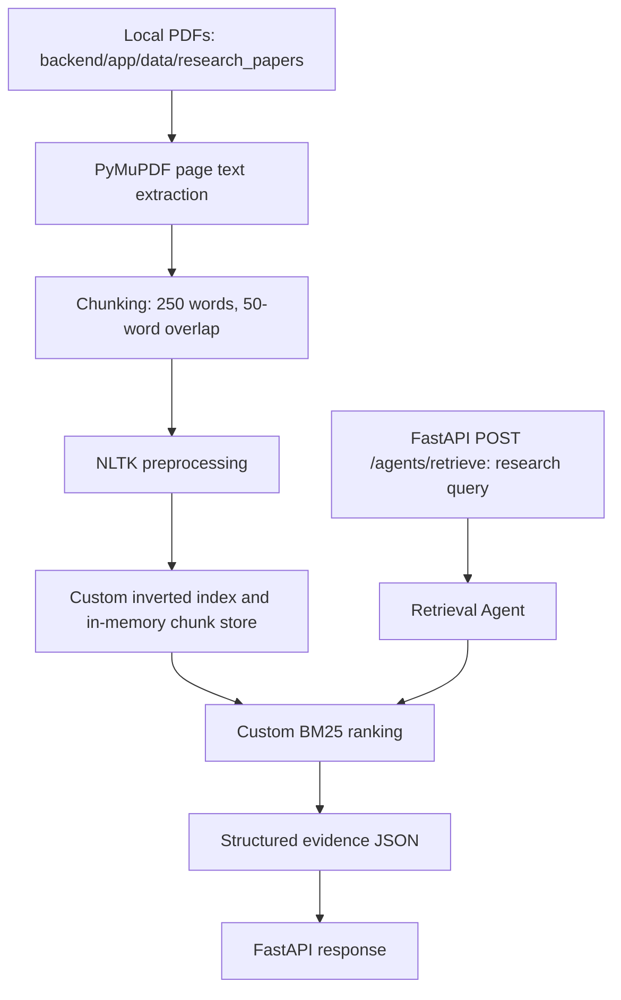
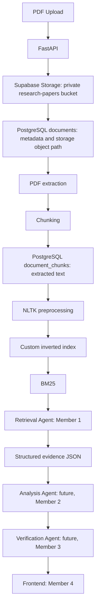

# Scientific Research AI architecture

Member 1 owns PDF ingestion, extraction, chunking, NLP preprocessing, the custom
inverted index, BM25 ranking, and structured evidence from the Retrieval Agent.
This change prepares persistent storage and isolated backend services. It does not
activate the future upload workflow or implement the other team members' agents.

## Current working runtime

`document_service.py` recursively loads local PDFs and preserves category,
filename, page text, and one-based page numbers. `chunking_service.py` creates
one-based chunk numbers within each page. A local chunk ID has the form
`<filename>_p<page_number>_c<chunk_number>`.

`indexing_service.py` preprocesses chunk text into tokens using NLTK and builds
postings of term to chunk ID to term frequency. The chunk store retains the raw
text, source metadata, and processed tokens. `retrieval_service.py` caches the
index and chunk store once per Python process using `lru_cache(maxsize=1)`.
Changing local PDFs therefore requires a process restart or an explicit cache
clear before those changes appear in retrieval results.

The existing BM25 scoring, query coverage adjustment, reference penalties, and
two-chunks-per-paper result limit remain unchanged. FastAPI still accepts the
existing `ResearchQuery` and returns the agent's JSON output. Supabase credentials,
tables, and the bucket are not required to run this local retrieval path.

## Intended shared architecture after a separately approved migration

Supabase provides persistent data storage. Supabase Storage holds PDF files in a
private bucket; PostgreSQL holds document metadata and extracted chunks. Raw PDF
binaries must never be stored in PostgreSQL. PostgreSQL does not replace BM25:
the custom inverted index and BM25 remain the Information Retrieval method.
There are no embeddings, vector search, pgvector, external search APIs, LangChain
retrievers, or LlamaIndex retrievers in this foundation.

The diagram shows the future data flow, not an implemented upload endpoint.
Migration will need to define ingestion orchestration, partial-failure handling,
and index/cache refresh after persistent chunks change. Auth and Render deployment
are later work. Analysis and Verification are outside this task, as are frontend
implementation and Docker.

## Foundation boundaries

| Component | Responsibility |
| --- | --- |
| `app/core/config.py` | Load backend settings from environment and the local backend `.env`; report configuration errors safely. |
| `app/core/supabase_client.py` | Lazily construct and cache the trusted backend Supabase client. |
| `app/services/database_service.py` | Create/read document metadata, update status, and create/read chunks. |
| `app/services/storage_service.py` | Upload/download/delete PDF objects in the existing private bucket. |
| `supabase/schema.sql` | Define metadata/chunk tables, integrity constraints, RLS, and minimum backend grants. |
| `tests/test_supabase_connection.py` | Verify configuration, client initialization, and a read-only document query. |

Agents should call service abstractions rather than call Supabase directly.
The new services are available for later orchestration but are not imported into
the current retrieval flow. Storage object operations and database operations are
separate: neither service automatically synchronizes the other or builds an index.
Running setup does not upload any local PDFs.

RLS is enabled on both tables and no frontend policies are added. The trusted
backend uses the secret key, and receives only the explicit database operations
required by the foundation. The key must never reach the frontend. Setup details
and manual dashboard steps are in [supabase-setup.md](supabase-setup.md).

## Persistent identifiers and evidence handoff

`documents.id` and `document_chunks.id` are UUIDs. Each chunk references its
document UUID and has a unique `(document_id, page_number, chunk_number)` tuple.
The database preserves the original filename, category, optional DOI/source URL,
and the storage object key on the parent document. These UUIDs are deliberately
separate from the current filename-based local chunk IDs; no mapping or identifier
replacement is activated by this foundation. A future adapter must preserve source
traceability when converting persistent rows into retrieval chunks.

`chunk_text` preserves the original extracted passage for evidence. Nullable
`processed_text` can hold the space-joined output of the existing NLP tokens, and
`token_count` can hold the number of processed tokens. They can remain null before
preprocessing. Storing processed text does not change the current tokenizer or
ranking behavior. Document status allows `uploaded`, `processing`, `indexed`, and
`failed`; future orchestration will manage these states. No database row becomes
indexed automatically when inserted.

The current success response includes `agent`, `status`, `original_query`,
`processed_query`, `total_results`, and `results`. Each result preserves
`chunk_id`, `filename`, `category`, `page_number`, `chunk_number`, `score`,
`matched_terms`, and the original `text`. This is the existing structured JSON
evidence boundary for the future Analysis Agent. API-based communication between
agents will build on that boundary; this task does not implement the handoff.
